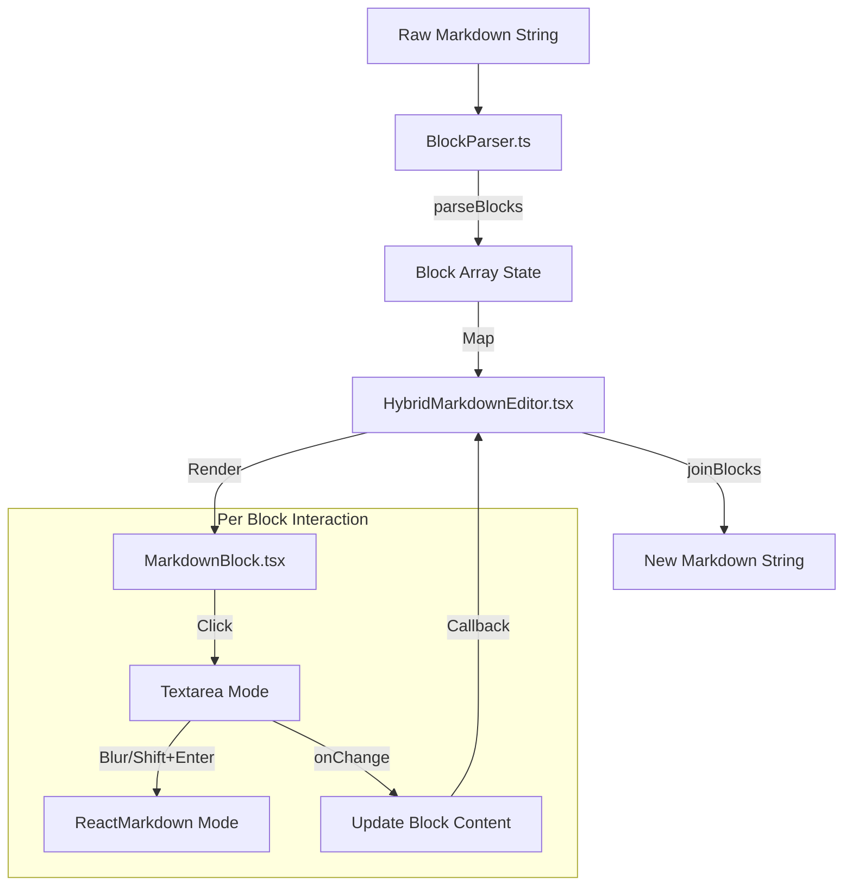

# Hybrid Editor Architecture

This walkthrough provides a detailed technical analysis of the **Hybrid Markdown Editor**, a block-based editor implementation that switches between a rich preview and a raw text editor on a per-block basis.

## Core Architecture

The editor uses a **Hybrid Block Model**. Instead of treating the document as a single large text area (like a standard textarea) or a complex rich-text tree (like ProseMirror/Draft.js), it splits the markdown document into distinct "Blocks".

### components High-Level Data Flow

1.  **Input**: Raw Markdown String
2.  **Parser**: Splits string into `Block[]`
3.  **Render**: Maps blocks to `MarkdownBlock` components
4.  **Edit**: User modifies a single block's text
5.  **Output**: Joins `Block[]` back into a single Markdown String



## Internal Components

### 1. The Parser (`BlockParser.ts`)

The parser is responsible for converting the raw markdown string into manageable blocks.

-   **Heuristic**: It primarily splits content by double newlines (`\n\n`), treating paragraphs as separate blocks.
-   **Code Block Awareness**: It maintains an `inCodeBlock` state to prevent splitting inside fenced code blocks (```...```).
-   **Data Structure**:
    ```typescript
    type Block = {
        id: string;      // UUID for React keys
        content: string; // The markdown text for this specific block
    };
    ```

### 2. The Container (`HybridMarkdownEditor.tsx`)

This component acts as the controller.

-   **State**: `const [blocks, setBlocks] = useState<Block[]>([])`
-   **Initialization**: Calls `parseBlocks(initialContent)` on mount.
-   **Change Handling**: 
    -   When a child block updates, it maps over the `blocks` array to update the specific block.
    -   It then calls `joinBlocks(newBlocks)` (which joins with `\n\n`) to notify the parent component of the new full document state.

### 3. The Block (`MarkdownBlock.tsx`)

This is the most complex component, handling the dual-state nature of the editor.

#### Dual States
1.  **Preview Mode (`isEditing = false`)**: 
    -   Renders the `content` using `react-markdown`.
    -   Uses `remark-gfm` for advanced markdown features (tables, strikethrough).
    -   Heavily customized styling via `css` prop to match the glassmorphic design system.
    -   **interaction**: `onClick` triggers `setIsEditing(true)`.

2.  **Edit Mode (`isEditing = true`)**:
    -   Renders a `TextareaAutosize` component containing the raw markdown.
    -   **Styling**: The textarea is styled to look "invisible" (transparent background, inherited fonts) so the jump between preview and edit is minimized, though the markup structure changes.
    -   **Exit Strategies**:
        -   `onBlur`: Clicking outside the block saves and switches to preview.
        -   `Shift+Enter`: A keyboard shortcut to explicitly save and exit.

#### Glassmorphism Implementation

The visual flair is achieved through extensive CSS-in-JS (Chakra UI's `css` prop) within `MarkdownBlock`.

-   **Headings**: Custom text shadows and margin adjustments.
-   **Code Blocks**: Delegates to `GlassCodeBlock.tsx` which likely wraps syntax highlighting in a translucent container.
-   **Dark Mode**: Uses `_dark` pseudo-props to adjust text shadows and colors for readability on dark backgrounds.

## Technical Trade-offs

### Advantages
-   **Performance**: Editing a long document only re-renders the specific block being edited, not the entire markdown tree (mostly).
-   **Simplicity**: Avoids the complexity of ContentEditable synchronization. Most "rich text" is just standard HTML rendering.
-   **Flexibility**: Easy to mix custom React components (like the GlassCodeBlock) into the preview.

### Limitations (Current Implementation)
-   **Parsing Fragility**: Splitting by `\n\n` is rudimentary. It doesn't understand nested structures (like lists) well—a list is currently treated as one large block if there are no double newlines, or broken incorrectly if there are.
-   **Layout Shift**: There is a visual "jump" when switching between the rendered HTML (Preview) and the raw Markdown (Edit), especially for elements like headers or tables.
-   **Global Search/Replace**: Harder to implement deeply because state is fragmented across blocks (though the parent holds the master list).

## Future Improvements

-   **Structure-Aware Parsing**: Using an AST (like `unist` or `remark`'s parser) to define blocks would strictly respect markdown scope (e.g., ensuring a block doesn't start inside a list item).
-   **Slash Commands**: Adding a command menu when typing `/` in a new block.
-   **Drag and Drop**: Reordering blocks is trivial since they are just items in an array.
