# Plans Flow: The Hybrid File/Database Architecture

## Executive Summary

The Plans system in BlueKit implements a **"Textbook + Marginalia"** pattern: markdown files are the canonical source of truth (the textbook), while the database stores user-created metadata like phases, milestones, and notes (the marginalia). This design elegantly balances:

- **File-driven workflows**: Users can edit markdown documents with any editor
- **Rich metadata persistence**: Database tracks user progress and annotations
- **Real-time synchronization**: File changes are detected and reconciled automatically

```mermaid
graph TB
    subgraph "Source of Truth"
        MD[("📄 Markdown Files<br/>(.bluekit/plans/*)")]
    end
    
    subgraph "User Metadata"
        DB[("💾 SQLite Database<br/>(phases, milestones, notes)")]
    end
    
    subgraph "Synchronization Layer"
        FW["🔍 File Watcher<br/>(watcher.rs)"]
        REC["🔄 Reconciliation<br/>(get_plan_documents)"]
    end
    
    subgraph "Frontend"
        PW["📐 PlanWorkspace"]
        PO["📋 PlanOverviewPanel"]
        PD["📖 PlanDocViewPage"]
    end
    
    MD -->|"file changes"| FW
    FW -->|"Tauri events"| PO
    PO -->|"invokeGetPlanDocuments"| REC
    REC -->|"scan folder"| MD
    REC -->|"sync records"| DB
    DB -->|"phases, milestones"| PO
    PO --> PW
    PW --> PD
```



---

## Key Takeaways (Grasp These First)

> [!IMPORTANT]
> ### The Three Pillars of the Plans Architecture
> 
> 1. **Files are authoritative**: Adding/removing `.md` files in a plan folder is immediately reflected in the UI
> 2. **Database is supplementary**: Stores what files cannot—phases, milestones, completion status
> 3. **Reconciliation is automatic**: The backend scans folders and syncs database records every time documents are requested

### What Files Store
- **Plan documents**: The actual markdown content (implementation plans, design docs, etc.)
- **Location**: Each plan has a dedicated folder at `.bluekit/plans/{plan-name}/`

### What the Database Stores
- **Plan metadata**: Name, description, status (active/completed/archived)
- **Phases**: Named stages of the plan with order indices
- **Milestones**: Checkable items within phases that track progress
- **Notes**: User annotations stored in localStorage (browser-side)

---

## The Data Flow: From File Change to UI Update

### 1. File Watching Initialization

When a user opens a plan, the frontend sets up real-time file watching:

```typescript
// PlanOverviewPanel.tsx - Setting up the watcher
useEffect(() => {
    if (!planId || !planDetails) return;

    const setupWatcher = async () => {
        // Tell backend to watch this plan's folder
        await invokeWatchPlanFolder(planId, planDetails.folderPath);
        
        // Listen for changes via Tauri event system
        const eventName = `plan-documents-changed-${planId}`;
        const unlisten = await listen<string[]>(eventName, (event) => {
            const changedPaths = event.payload;
            updatePlanDocumentsIncremental(changedPaths);
        });
    };

    setupWatcher();
    
    return () => {
        // Cleanup: stop watching when component unmounts
        invokeStopWatcher(`plan-documents-changed-${planId}`);
    };
}, [planId, planDetails?.folderPath]);
```

### 2. Backend File Watcher (Rust)

The backend uses `notify-rs` with production-grade reliability:

```rust
// watcher.rs - Configuration
const CHANNEL_BUFFER_SIZE: usize = 100;   // Bounded channel prevents OOM
const DEBOUNCE_DURATION_MS: u64 = 300;    // Batch events within 300ms window
const MAX_RETRY_ATTEMPTS: u32 = 5;        // Auto-restart with exponential backoff
```

Key features:
- **Debouncing**: Multiple rapid file changes are batched into a single event
- **Bounded channels**: Prevents memory exhaustion from event storms
- **Auto-recovery**: Watcher restarts automatically on failure
- **File type filtering**: Only watches `.md`, `.mmd`, `.mermaid`, `.json` files

```rust
// commands.rs - Setting up the plan folder watcher
pub async fn watch_plan_folder(
    app: AppHandle,
    plan_id: String,
    folder_path: String,
) -> Result<(), String> {
    let event_name = format!("plan-documents-changed-{}", plan_id);
    let path = PathBuf::from(folder_path);
    crate::core::watcher::watch_directory(app, path, event_name)
}
```

### 3. Document Reconciliation (The Magic)

When documents are requested, the backend **reconciles** filesystem state with database:

```rust
// plan_operations.rs - get_plan_documents
pub async fn get_plan_documents(
    db: &DatabaseConnection,
    plan_id: String,
) -> Result<Vec<PlanDocumentDto>, DbErr> {
    // Get plan to find folder path
    let plan_model = plan::Entity::find_by_id(&plan_id).one(db).await?;
    let folder_path = Path::new(&plan_model.folder_path);

    // Get existing documents from DB
    let existing_docs = plan_document::Entity::find()
        .filter(plan_document::Column::PlanId.eq(&plan_id))
        .all(db).await?;
    
    let mut existing_paths: HashMap<String, Model> = 
        existing_docs.into_iter().map(|d| (d.file_path.clone(), d)).collect();

    let mut documents = Vec::new();

    // Scan folder for .md files
    for entry in fs::read_dir(folder_path)? {
        let path = entry?.path();
        
        if path.is_file() && path.extension() == Some("md") {
            if let Some(doc) = existing_paths.remove(&file_path_str) {
                // EXISTS in both: Use DB record
                documents.push(doc.into_dto());
            } else {
                // NEW file: Create DB record
                let doc_model = plan_document::ActiveModel {
                    id: Set(Uuid::new_v4().to_string()),
                    plan_id: Set(plan_id.clone()),
                    file_path: Set(file_path_str),
                    file_name: Set(file_name),
                    // ... timestamps
                }.insert(db).await?;
                
                documents.push(doc_model.into_dto());
            }
        }
    }

    // Delete ORPHANED documents (files that no longer exist)
    for (_, orphan) in existing_paths {
        plan_document::Entity::delete_by_id(orphan.id).exec(db).await?;
    }

    Ok(documents)
}
```

> [!TIP]
> This reconciliation pattern is the heart of the hybrid system. It's called every time `invokeGetPlanDetails` or `invokeGetPlanDocuments` is invoked, ensuring the database always reflects the current filesystem state.

---

## The Type System: Data Structures

### Frontend Types (TypeScript)

```typescript
// types/plan.ts

interface Plan {
    id: string;
    name: string;
    projectId: string;
    folderPath: string;        // Filesystem path - the canonical location
    description?: string;
    status: 'active' | 'completed' | 'archived';
    progress: number;          // Calculated from milestones
}

interface PlanPhase {
    id: string;
    planId: string;
    name: string;
    orderIndex: number;        // User-defined ordering
    status: 'pending' | 'in_progress' | 'completed';
}

interface PlanMilestone {
    id: string;
    phaseId: string;
    name: string;
    orderIndex: number;
    completed: boolean;        // The "checkbox" in margins
    completedAt?: number;
}

interface PlanDocument {
    id: string;
    planId: string;
    filePath: string;          // Absolute path to .md file
    fileName: string;
}

interface PlanDetails extends Plan {
    phases: PlanPhaseWithMilestones[];
    documents: PlanDocument[];
    linkedPlans: PlanLink[];
    progress: number;
}
```

### Backend Entities (Rust/SeaORM)

```
plans (table)
├── id (PK)
├── project_id (FK → projects)
├── name
├── folder_path              ← Points to filesystem
├── description
├── status
└── timestamps

plan_phases (table)
├── id (PK)
├── plan_id (FK → plans)
├── name, description
├── order_index
├── status
└── timestamps

plan_milestones (table)
├── id (PK)
├── phase_id (FK → plan_phases)
├── name, description
├── order_index
├── completed (boolean as i32)
└── timestamps

plan_documents (table)
├── id (PK)
├── plan_id (FK → plans)
├── file_path                              ← Filesystem path
├── file_name
└── timestamps
```

---

## Component Architecture


### PlanWorkspace: The Orchestrator

[PlanWorkspace.tsx](file:///Users/stephanchiorean/Documents/projects/blueKitApps/blueKit/src/components/plans/PlanWorkspace.tsx) manages:

1. **Split layout**: Resizable sidebar (overview) + content panel (document viewer)
2. **State synchronization**: Selected document index shared between panels
3. **Data loading**: Fetches `PlanDetails` on mount

```typescript
export default function PlanWorkspace({ plan, onBack, onPlanDeleted }) {
    const [planDetails, setPlanDetails] = useState<PlanDetails | null>(null);
    const [selectedDocIndex, setSelectedDocIndex] = useState(0);

    // Load plan details (triggers document reconciliation)
    const loadPlanDetails = useCallback(async () => {
        const details = await invokeGetPlanDetails(planId);
        setPlanDetails(details);
    }, [planId]);

    // Sort documents for consistent ordering
    const sortedDocuments = useMemo(() => 
        [...planDetails.documents].sort((a, b) => 
            a.fileName.localeCompare(b.fileName)
        ), 
    [planDetails?.documents]);

    return (
        <Splitter.Root>
            <Splitter.Panel id="overview">
                <PlanOverviewPanel
                    planDetails={planDetails}
                    selectedDocumentId={sortedDocuments[selectedDocIndex]?.id}
                    onSelectDocument={handleDocumentSelect}
                    onUpdate={handlePlanUpdate}  // Triggers silent refresh
                />
            </Splitter.Panel>
            
            <Splitter.Panel id="docview">
                <PlanDocViewPage
                    documents={sortedDocuments}
                    currentIndex={selectedDocIndex}
                    onNavigate={handleDocNavigate}
                />
            </Splitter.Panel>
        </Splitter.Root>
    );
}
```

### PlanOverviewPanel: The Watcher & Controller

[PlanOverviewPanel.tsx](file:///Users/stephanchiorean/Documents/projects/blueKitApps/blueKit/src/components/plans/PlanOverviewPanel.tsx) is responsible for:

1. **File watching**: Sets up directory watcher on mount
2. **User interactions**: Status changes, milestone toggling, plan completion
3. **Notes management**: LocalStorage-backed user annotations

```typescript
// Key pattern: File watcher lifecycle
useEffect(() => {
    const setupWatcher = async () => {
        await invokeWatchPlanFolder(planId, planDetails.folderPath);
        
        const unlisten = await listen<string[]>(eventName, (event) => {
            if (event.payload.length > 0) {
                updatePlanDocumentsIncremental(event.payload);
            } else {
                onUpdate();  // Full refresh
            }
        });
    };

    setupWatcher();
    
    return () => {
        invokeStopWatcher(eventName);  // Clean up watcher
    };
}, [planId, planDetails?.folderPath]);
```

### PlanDocViewPage: The Reader

[PlanDocViewPage.tsx](file:///Users/stephanchiorean/Documents/projects/blueKitApps/blueKit/src/components/plans/PlanDocViewPage.tsx) provides:

1. **Document navigation**: Previous/next buttons with keyboard shortcuts
2. **Markdown rendering**: Full markdown viewer with syntax highlighting
3. **Real-time content updates**: Listens for content changes

---

## IPC Layer: Frontend ↔ Backend Communication

All plan operations go through type-safe IPC wrappers in [plans.ts](file:///Users/stephanchiorean/Documents/projects/blueKitApps/blueKit/src/ipc/plans.ts):

| Function | Purpose |
|----------|---------|
| `invokeCreatePlan` | Creates plan folder + DB record |
| `invokeGetProjectPlans` | Lists all plans for a project |
| `invokeGetPlanDetails` | Full plan data with phases, milestones, documents |
| `invokeUpdatePlan` | Modify name, description, status |
| `invokeDeletePlan` | Remove folder + cascade delete DB records |
| `invokeCreatePlanPhase` | Add a new phase |
| `invokeCreatePlanMilestone` | Add a milestone to a phase |
| `invokeToggleMilestoneCompletion` | Check/uncheck milestone |
| `invokeGetPlanDocuments` | Scan folder, reconcile with DB |
| `invokeWatchPlanFolder` | Start file watcher |

---

## The "Notes in Margins" Pattern

### What It Means

| Aspect | Files (Textbook) | Database (Margins) |
|--------|------------------|-------------------|
| **Content** | Markdown documents | Phases, milestones |
| **Authority** | Source of truth | Supplementary metadata |
| **Persistence** | Git-trackable, portable | Local to this installation |
| **Editing** | Any text editor | BlueKit UI only |
| **Example** | `implementation-plan.md` | "Phase 1: Setup" → 3 milestones |

### Why This Design?

1. **Portability**: Clone the repo, get all plan content. No DB export needed.
2. **Flexibility**: Users can create/edit docs outside BlueKit
3. **Version Control**: Markdown files can be committed; progress is ephemeral
4. **Separation of Concerns**: Content vs. workflow tracking are distinct

### User Notes: Browser-Stored Marginalia

Notes are stored in `localStorage` keyed by plan path:

```typescript
// PlanOverviewPanel.tsx
const notesKey = `bluekit-plan-notes-${plan.path}`;

// Auto-save notes on change
useEffect(() => {
    const timer = setTimeout(() => {
        localStorage.setItem(notesKey, notes);
    }, 1000);
    return () => clearTimeout(timer);
}, [notes]);
```

---

## Error Handling & Recovery

### File Watcher Resilience

The watcher infrastructure includes several reliability features:

```rust
// watcher.rs - Auto-recovery with exponential backoff
if exit_reason == ExitReason::Error && restart_count < MAX_RETRY_ATTEMPTS {
    let delay_ms = RETRY_BASE_DELAY_MS * 2u64.pow(restart_count);
    sleep(Duration::from_millis(delay_ms)).await;
    
    start_directory_watcher_with_recovery(
        app_handle,
        dir_path,
        event_name,
        restart_count + 1,
    );
}
```

### Frontend Error Propagation

```typescript
// IPC calls use timeout wrapper
import { invokeWithTimeout } from '../utils/ipcTimeout';

export async function invokeGetPlanDetails(planId: string): Promise<PlanDetails> {
    return await invokeWithTimeout<PlanDetails>('get_plan_details', { planId });
}
```

---

## Summary: The Complete Flow


---

## Key Files Reference

| Layer | File | Purpose |
|-------|------|---------|
| **Frontend** | [PlanWorkspace.tsx](file:///Users/stephanchiorean/Documents/projects/blueKitApps/blueKit/src/components/plans/PlanWorkspace.tsx) | Orchestrates split layout and state |
| **Frontend** | [PlanOverviewPanel.tsx](file:///Users/stephanchiorean/Documents/projects/blueKitApps/blueKit/src/components/plans/PlanOverviewPanel.tsx) | File watching, user interactions |
| **Frontend** | [PlanDocViewPage.tsx](file:///Users/stephanchiorean/Documents/projects/blueKitApps/blueKit/src/components/plans/PlanDocViewPage.tsx) | Markdown document viewer |
| **IPC** | [plans.ts](file:///Users/stephanchiorean/Documents/projects/blueKitApps/blueKit/src/ipc/plans.ts) | Type-safe IPC wrappers |
| **Types** | [plan.ts](file:///Users/stephanchiorean/Documents/projects/blueKitApps/blueKit/src/types/plan.ts) | TypeScript interfaces |
| **Backend** | [plan_operations.rs](file:///Users/stephanchiorean/Documents/projects/blueKitApps/blueKit/src-tauri/src/db/plan_operations.rs) | Database operations, reconciliation |
| **Backend** | [commands.rs](file:///Users/stephanchiorean/Documents/projects/blueKitApps/blueKit/src-tauri/src/commands.rs) | Tauri command handlers |
| **Backend** | [watcher.rs](file:///Users/stephanchiorean/Documents/projects/blueKitApps/blueKit/src-tauri/src/core/watcher.rs) | File watching infrastructure |
| **Entities** | [plan.rs](file:///Users/stephanchiorean/Documents/projects/blueKitApps/blueKit/src-tauri/src/db/entities/plan.rs) | SeaORM entity definitions |
