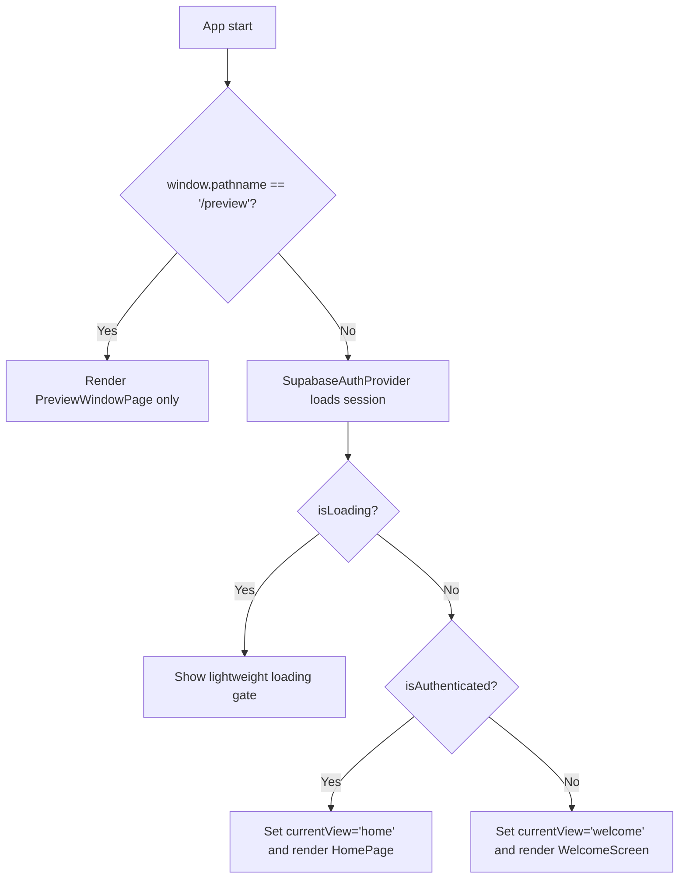

## Skip Welcome Screen When Authenticated

### Goal

**Open BlueKit directly into the main app (`HomePage` / project views) whenever a Supabase session is already present, while still showing the existing `WelcomeScreen` for unauthenticated users, and allowing a brief loading state during auth initialization.**

### Key Places to Change

- **`src/App.tsx`**: Currently controls top-level view state (`currentView: 'welcome' | 'home' | ...`) and always starts at `'welcome'`, rendering `WelcomeScreen` unconditionally for the initial view.
- **`src/components/WelcomeScreen.tsx`**: Uses `useSupabaseAuth` to show different content when `isAuthenticated` and calls `onGetStarted` to enter the app.
- **`src/contexts/SupabaseAuthContext.tsx`**: Provides `isLoading` and `isAuthenticated` flags based on the Supabase session.

### Implementation Steps

- **Step 1: Use auth state in `AppContent` to decide the initial view**
  - Import `useSupabaseAuth` into `AppContent` in [`src/App.tsx`](src/App.tsx).
  - Read `isAuthenticated` and `isLoading` from the auth context.
  - Change the initial `currentView` state from `'welcome'` to:
    - `'home'` if `!isLoading && isAuthenticated` at mount time.
    - `'welcome'` otherwise, so unauthenticated users still see the Welcome screen.

- **Step 2: Add a lightweight loading gate before rendering the Welcome screen**
  - In `AppContent`, before the main JSX return for the non-preview path, add a small conditional:
    - While `isLoading` is `true`, render a simple loading container (e.g., centered spinner + “Loading BlueKit…” text) or reuse a minimal part of the existing `WelcomeScreen` styling without showing the full signed-in card.
    - Once `isLoading` is `false`, proceed to render the normal view switch based on `currentView`.
  - This ensures that when a saved Supabase session is being restored, the Welcome screen with the “You’re signed in!” card is **not** shown; instead the app jumps to the home view after loading completes.

- **Step 3: Keep `WelcomeScreen` only for unauthenticated users**
  - Leave `WelcomeScreen`’s internal logic mostly intact, since you still want it for guests.
  - Optionally, simplify the `isAuthenticated` branch inside `WelcomeScreen` so that, in cases where it ever mounts with an authenticated user, it either immediately calls `onGetStarted` (via an effect) or shows a very brief “Entering BlueKit…” state rather than the explicit “Continue to BlueKit” button.
  - This is a safety net but in the primary flow, authenticated users will never see `WelcomeScreen` because `AppContent` will start directly at `'home'`.

- **Step 4: Verify behavior across launch scenarios**
  - **Fresh unauthenticated launch**: `isLoading` finishes, `isAuthenticated` is `false` → `currentView` stays `'welcome'` → `WelcomeScreen` appears; clicking any "Continue" path calls `onGetStarted` and flips `currentView` to `'home'`.
  - **Launch with existing Supabase session**: `isLoading` starts `true`, then `false` with a valid `session` → `isAuthenticated` is `true` and initial `currentView` becomes `'home'` → app opens directly into `HomePage` with no intervening welcome screen.
  - **Sign-out flow** (if present in UI): after `signOut`, confirm that `isAuthenticated` becomes `false` and any navigation back to the root (or app reload) shows `WelcomeScreen` again.

### Optional Small Cleanup (If Needed)

- If any code path still manually routes to `'welcome'` for authenticated users, remove or guard those to ensure the welcome view is only used when `!isAuthenticated`.
- Add a short inline comment near the `currentView` initialization in `AppContent` explaining the “skip welcome when already authenticated” behavior for future maintainers.

### Mermaid Diagram (Auth-aware App Entry Flow)

